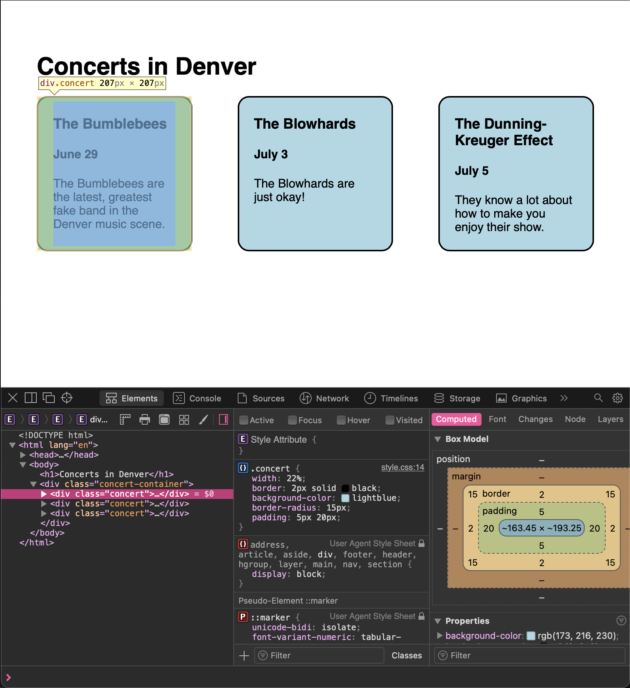

# More Boxes

We've been talking a lot about boxes, but so far we haven't fully discovered the full picture. CSS has evolved a ton over the years to accommodate for much more complex website layouts.

If we want to build this page:

we need to know more about the box model.

## Margin, Padding, and Borders

If you look at the image above, you can see that there is plenty of empty space keeping things looking clean and readable. For instance, there is space between the borders of the concert sections and the content inside. There's also space between the edges of the webpage and the contents of the webpage. CSS gives us control over how elements behave with their parent, sibling, and child elements with margins, padding, and borders.

Margins define the space outside an element. If we pop open our favorite browser's dev tools (use these instructions for [chrome/edge](https://developer.chrome.com/docs/devtools/open/), [safari](https://support.apple.com/guide/safari/use-the-developer-tools-in-the-develop-menu-sfri20948/mac), or [firefox](https://developer.mozilla.org/en-US/docs/Tools)), we can see this in action.

Let's look at the main header in the inspector (you can find the code for this page <a href="../../../../curriculum_companions/web_dev/fe_fun/structural_elements" target="_blank">here</a>):

If we hover over the `h1` tag in the elements tab, we can see the margins displayed in orange on top of the element; in blue is the size of the content. On the bottom right of the screen, we see the entire box model. We can see the height of the margins, border, padding, and content in pixels. In this case, our element is 743px wide, 37px tall, and has margins of 21.44px above and below the contents of the element.

#### Margin

Margins essentially affect the space outside of an element. Margins add space between elements that are siblings or parents of an element.

#### Padding

Padding affects the space between an element and its children. In the images above, the blue concert `div`s all have padding to make sure the elements inside don't extend their contents all the way to the borders.

#### Border

Borders take up the space between margins and padding. They can take up quite a bit of space, as there's no limit to how big our borders can be. It might seem strange that borders sit between padding and margins, but this actually helps us create interesting layouts. If borders didn't account for padding, the layout above wouldn't even be possible. Let's look at a concert div in the inspector:

We can see that the concert class adds some padding to the sides and top of the element, represented in green, which gives the inner contents less space to occupy. We can also see that if the border didn't account for padding, the border would basically pass through the text content on the left side of the content box.

