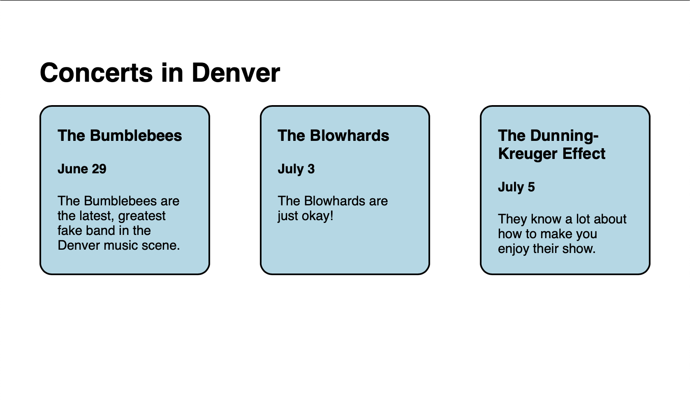

# Display

Now that we understand the box model a bit more, we need to learn the final piece of the puzzle for creating the layout we see in our example here:

So far, we've played around with boxes and what's called "outer display" (`inline` and `block`). Outer display defines how an element behaves relative to its siblings and parents. However, if we want to really yield the full power of CSS layout, we need to master inner display.

## Looking Within

Inner display defines how an element's children will behave. So far, when we've wrapped our contents in `div`s, our elements have behaved the same way as they would if they were just in the `body`. The only difference is that our elements are now confined within the space available in the `div`. Modern sites however, have different needs. For instance, `block` and `inline` elements alone can't help us achieve the image above very easily. We need the 3 blue boxes to behave differently than text in a blog site.

It would be really nice if we could get the blue boxes to go next to each other like `inline` elements, take up space like `block` elements, and flow "responsively" based on the size of the page. Luckily, we can change the display of our elements using the `display` property.

One option available to us is to change all the blue box `div`s to have a kind of hybrid outer display called `inline-block`. That would solve problems 1 and 2, but it's not really designed for responsiveness.