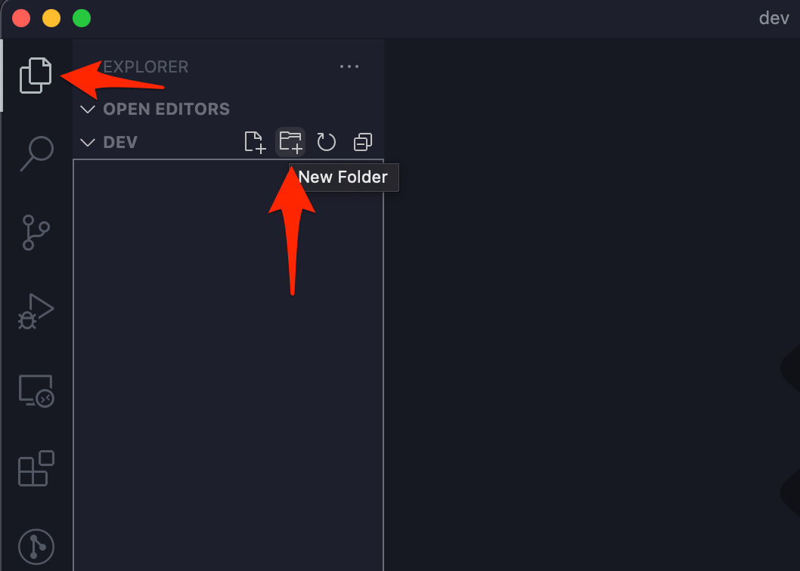
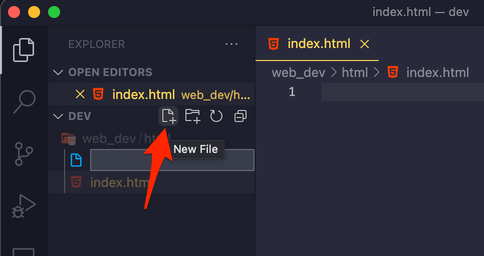
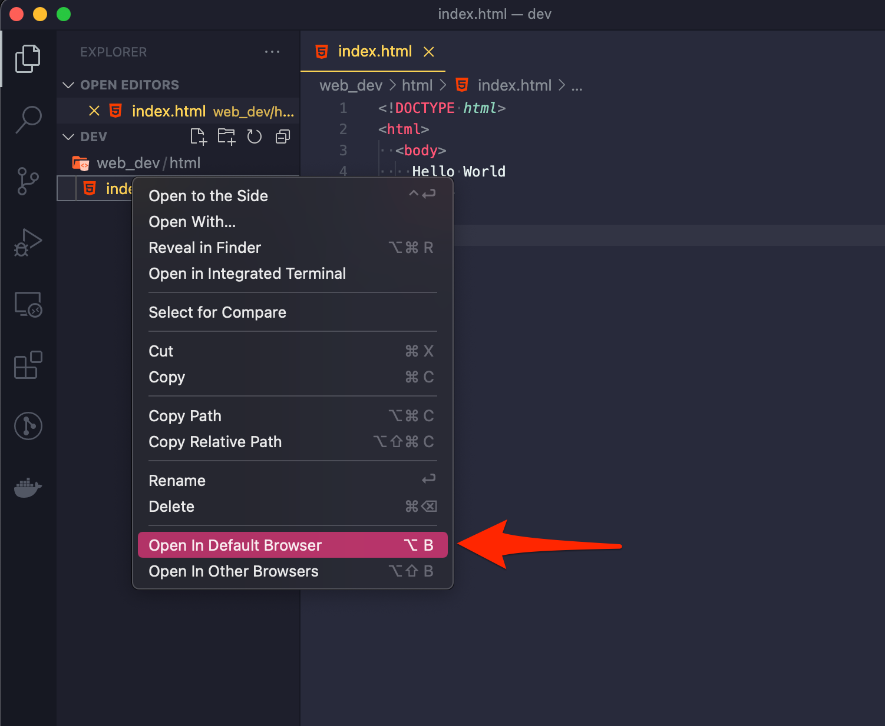

# Baby's First HTML Document

<!-- 
  Objectives:
  - Learn the VS Code interface
  - Learn how to create html files
 -->

It is a long-running tradition that when an engineer is learning a new programming language, their first working line of code in the new language forces a computer to utter the words "Hello World". Not necessarily in a creepy robot voice, but in the elegant medium of the written word (typically in mono-spaced font). It might be because the task of getting a computer to print "Hello World" on a screen is relatively straightforward, or because it gives us a useful building block to start writing more complex code, but it's also equally likely (in our assessment) that we all like feeling like we're part of an elaborate, nerdy inside joke (hooray to you for finally making it to the inside).

## It's Alive!!!

If you already downloaded [VS Code](https://code.visualstudio.com) (or a different editor, you stubborn person you), then you're in great shape. It's time to make our first HTML document. Also, now is a good time to triple-check that you have Visual Studio Code, ***not Visual Studio***.

1. Open Visual Studio Code (or your other text editor)
1. Use the file menu to open your `dev` folder in Visual Studio Code (the one we created in the intro in the computer's root folder)
1. Create a new folder called `web_dev`
    - You can make a new folder in VS Code with the "New Folder" button in the explorer tab 
1. Inside the `web_dev` folder, make another new folder called `html`
1. Inside the `html` folder create a file called `index.html`. The ".html" part is all we need to tell VS Code (and the browser) that it's dealing with an HTML file
    - The "New File" button is right next to the "New Folder" button 
1. Click on the new file to open it and copy/paste the following HTML code in its entirety:
    - ```html
      <!DOCTYPE html>
      <html>
        <body>
          Hello World
        </body>
      </html>
      ```
1. Finally, save the file and open it in your favorite browser by right clicking the HTML file in the VS Code Explorer and choosing "Open in Default Browser"
    - 

It might not look like much. But we've just made the computer do our bidding with code. It's a huge first step!