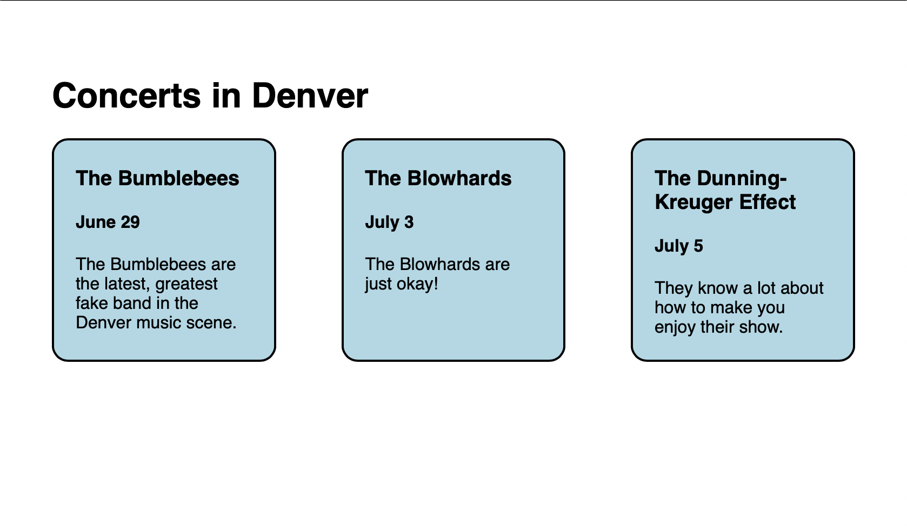

# CSS FlexBox

Let's start our journey making more advanced layouts by exploring CSS FlexBox (flexible box layout), or `flex` display. Let's keep looking at our example:


FlexBox gets its name for its ability to make the space between elements flexible. Essentially, `flex` allows us to control the spacing of elements in one direction, either horizontally or vertically. To better explain this behavior, let's see it in action!
## WTFlex?

In order for us to use `flex` on the blue boxes, we need to create a new `div`, which will treat all of the concert boxes as children.

```html
<body>
  <h1>Concerts in Denver</h1>
  <div class="concert-container">
    <div class="concert">
    <h3>The Bumblebees</h3>
      <h4>June 29</h4>
      <p>
        The Bumblebees are the latest, greatest fake band in the Denver
        music scene.
      </p>
    </div>
    <div class="concert">
      <h3>The Blowhards</h3>
      <h4>July 3</h4>
      <p>The Blowhards are just okay!</p>
    </div>
    <div class="concert">
      <h3>The Dunning-Kreuger Effect</h3>
      <h4>July 5</h4>
      <p>They know a lot about how to make you enjoy their show.</p>
    </div>
  </div>
</body>
```

Now, let's add an inner display type of `flex` to our `concert-container` class.
```css
.concert-container {
  display: flex;
}
```
If you want to follow along, here's the CSS for the `concert` class:
```css
.concert {
  width: 22%;
  border: 2px solid black;
  background-color: lightblue;
  border-radius: 15px;
  padding: 5px 20px;
}
```

You might have noticed that our boxes are now sitting right next to each other! The inner display of the `concert-container` class is changing the way its children are behaving!

We said earlier that FlexBox allows us to control the space between elements in one direction. By default, `flex` will affect space in the horizontal direction. Let's see what happens when we change the `justify-content` property. Let's change `justify-content` to `space-between`.
```css
.concert-container {
  display: flex;
  justify-content: space-between;
}
```
If you're following along, you might have noticed that each of the concert boxes has now spread out so that there's equal space between them, with the outer-most boxes spread out to the outside of the page! Now drag the size of your browser window so it gets bigger and smaller and see how the space flexibly changes depending on the available space in the browser window!

This is the power of `flex`. With just 2 lines of CSS, we've created a layout that is starting to look like a real, modern website!